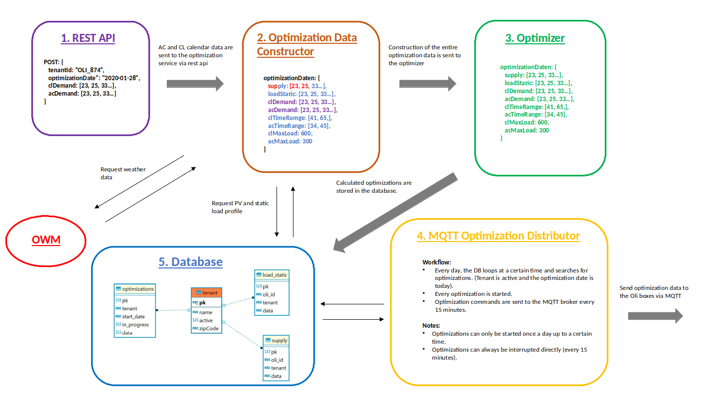

# Dose Optimizer
Dose Optimizer is a Service which optimizes demands of air conditions and charging station for electric cars. The optimization is made based on the following four points: 
* Static load profile of a property
* Predicted photovoltaic supply
* Air condition demand
* Charging station demand

The optimization Service consists of five main components
1. A Rest Api which is used to perform CRUD operation for optimizations and tenant data.
2. An optimization data constructor, which collects weather data, device metadata, and demand data of the optimizations.
3. An optimizer which optimizes the demands.
4. A MQTT service, which sends the demand values to an mqtt broker.
5. A local database, which contains tenant data, device data and optimizations.

The following graphic illustrates the interaction of these components:



## Installation
The service can be installed in two ways:

### Local
1. Install npm packages.
```
npm install
```  

2. Build the project.  
```
npm run build
```  
3. Set all environment variables. See ```./.env.example```.  
   
4. Start app.
```
npm run start:prod
```
Requirements for step 4:
* pm2 must be installed globally

The service can be run in develop mode as well, by running:
```
npm run dev
``` 

### Docker
1. Uset the ```./Dockerfile``` file to build an docker image of the optimization service.

2. Set all environment variables of the ```/.env.example``` file and start the optimization container.

## Documentation
The source code documentation lies under ```./docs.```. It exists as html files, which can be read by any we browser. Only open the ```./docs/index.html``` file to see the documentation. The documentation is auto generated by typedocs. If in the source code any changes are made, the documentation can be automatically new generated by: 
```
typedoc --out docs/ src/
```
Requirements:
* typedoc

## Testing
The service must be started before it can be tested. The optimization algorithm can be tested in two ways:

### Visual Tests
The virtual tests are carried out in the web browser by calling the following URL: ```http://host-address/test```.  
The host used during installation process before must be used as the host. However, the configurations for the host, must be adjusted in ```./test/optimization-plots/config.js``` as well before starting the service.

The website ```http://host-address/test``` contains three test scenarios that can be selected via tabs. Each tab contains a graph that contains unoptimized test data. The data of the graph are described in the legend to the right of the graph. There is an "Optimize" button under the unoptimized graphs. If this button is pressed, a new graph appears below that shows the results of the optimization. If you move the mouse pointer over the graphs, its values are displayed in the form of tooltips.

### Unit Tests
Unit tests are performe by using the following npm command: 
```
npm run test:unit
```

## Usage
The service can be controlled via a REST API:

### Authentification
All requests requiring an authentication. The authentication is applied, by sending a bearer token as value of the authentication property in the request headers. In the DOSE architecture, a keycloak service is managing the authentication service. Therefor a file ```./keycloak.json``` must be created in the project root directory according to the ```./keycloak.example.json``` file. 

### Optimization Resource
| Method  | Endpoint  | Parameter  | Response  |
| ------------- | ------------- | ------------ | ------------ |
| GET  | /v1/optimizations/:oliId  | -  | body: optimization object; statusCode: 200  |
| POST  | /v1/optimizations  | body: optimization object  | body: optimization object; statusCode: 201  |
| DELETE  | /v1/optimizations/:optimizationPk  | -  |  statusCode: 200  |

Note:  
Optimization object structure, can be found under: ```./src/data-models/energy-profiles.ts```

### Tenant Resource
| Method  | Endpoint  | Parameter  | Response  |
| ------------- | ------------- | ------------ | ------------ |
| GET  | /v1/tenant/activation/:oliId  | -  | body: active: 0/1 statusCode: 200  |
| PATCH  | /v1/tenant/activation/:oliId  | body: {active: 0/1}  | statusCode: 200  |

Note:  
active: 1 -> optimization mechanism is activated  
active: 0 -> optimization mechanism is not activated

## Logging
All requests against the rest api are logged under: ```./logs```
